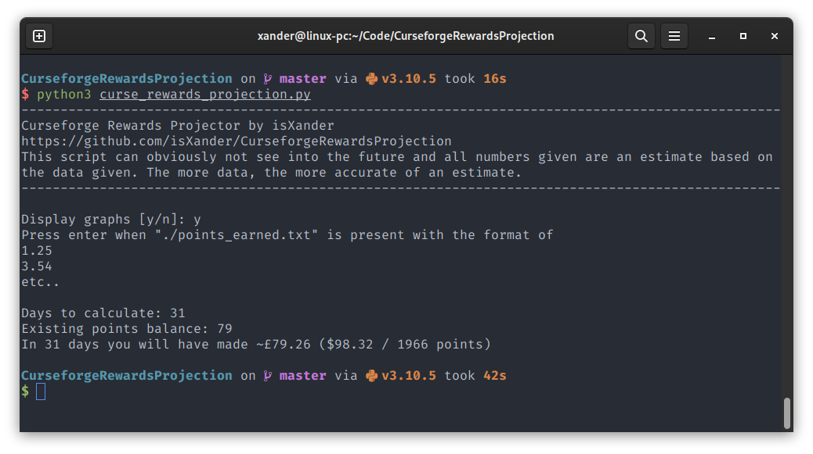
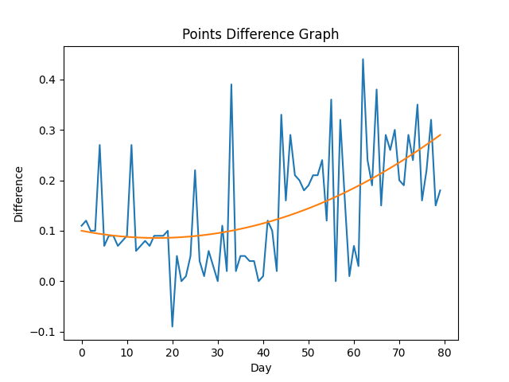

# Curseforge Rewards Projection
This script allows you to visualize your growth with graphs 
and estimate how much you will earn using your points data in a certain amount of days.

### How to use
1. Clone and enter the repository with `git clone https://github.com/isXander/CurseforgeRewardsProjection.git && cd CurseforgeRewardsProjection`
2. Make sure you have python3 and pip installed.
3. Install all requirements with `pip install -r requirements.txt`
4. Run the script with `python3 curse_rewards_projection.py` and follow the instructions

### Screenshots
*Data displayed in examples is not real!*

